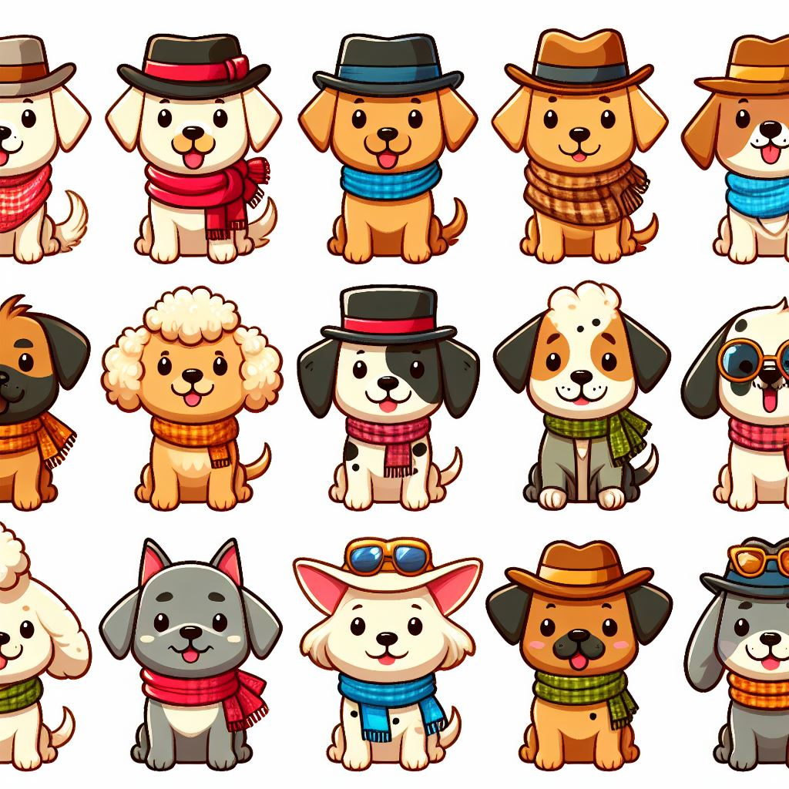
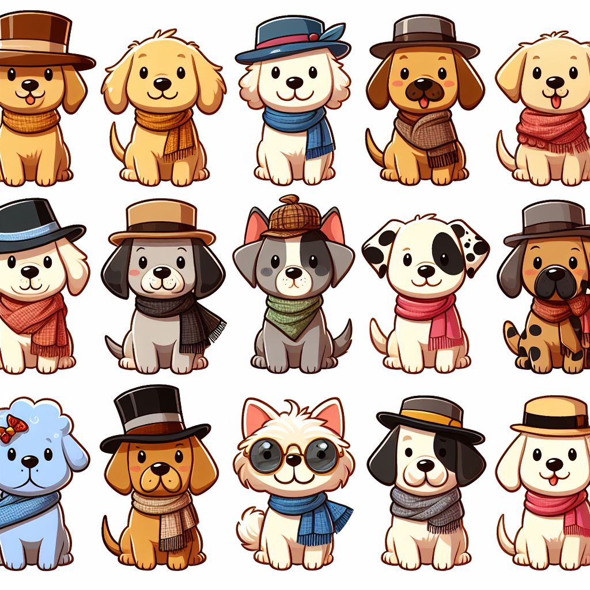
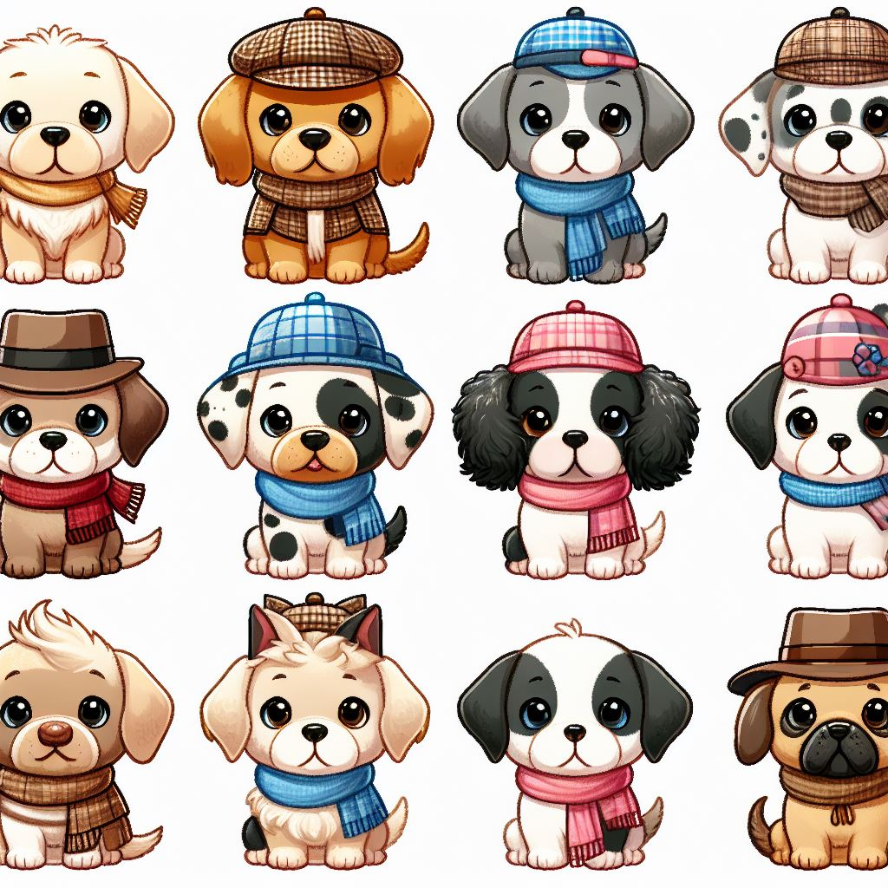

# End-to-End Multi-class Dog Breed Classification

## 1. Problem
Identifying the breed of a dog given an image of the dog.

## 2. Data
The dataset used is from Kaggle's dog breed identification competition, which can be found [here](https://www.kaggle.com/c/dog-breed-identification/data).

## 3. Evaluation
The evaluation involves creating a file with prediction probabilities for each dog breed of each test image. More details about the evaluation can be found [here](https://www.kaggle.com/c/dog-breed-identification/overview/evaluation).

## 4. Features
- The data consists of images, and deep learning/transfer learning techniques are used for classification.
- There are 120 breeds of dogs (classes).
- Approximately 10,000+ labeled images in the training set.
- Approximately 10,000+ unlabeled images in the test set.

## Key Steps in the Notebook:
1. Unzipping the uploaded data into Google Drive.
2. Importing necessary libraries, including TensorFlow and TensorFlow Hub.
3. Checking for GPU availability.
4. Loading and exploring the dataset, including checking the distribution of dog breeds.
5. Creating TensorFlow data batches and preprocessing images.
6. Creating a validation set since the Kaggle dataset does not provide one.
7. Defining the model architecture using a pre-trained MobileNetV2 model from TensorFlow Hub.
8. Training the model on a subset of the data and evaluating its performance.
9. Visualizing data batches and model predictions.
10. Saving and loading the trained model.
11. Training the model on the full dataset.
12. Making predictions on the test dataset and preparing the predictions for submission to Kaggle.
13. Saving the predictions to a CSV file for submission.
14. Making predictions on my dog image.

The notebook provides a comprehensive walkthrough of building, training, and evaluating a deep learning model for dog breed classification. Additionally, it demonstrates how to make predictions on new data and prepares the results for submission to a Kaggle competition.

